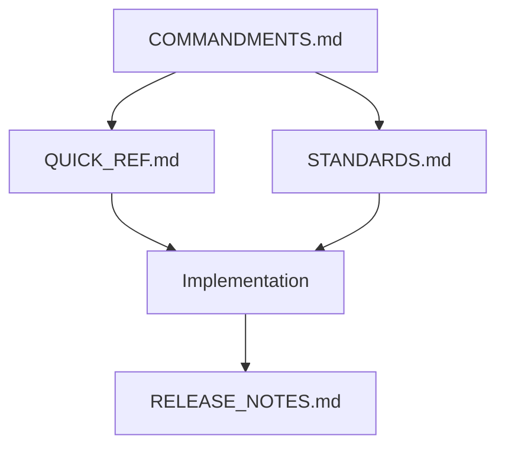

# Voidbox Documentation Index

## Core Documentation
| Document | Purpose | When to Use |
|----------|---------|-------------|
| [📜 COMMANDMENTS.md](./COMMANDMENTS.md) | Core principles and rules | First stop for any decision |
| [⚡ QUICK_REF.md](./QUICK_REF.md) | Implementation patterns | When coding |
| [📚 STANDARDS.md](./STANDARDS.md) | Detailed guidelines | Deep dive into standards |

## Quick Links by Topic

### 🔒 Security
- [JWT Implementation](./STANDARDS.md#security-requirements)
- [Error Handling](./QUICK_REF.md#defensive-programming)
- [Input Validation](./QUICK_REF.md#input-validation)

### 📱 Mobile First
- [UI Standards](./STANDARDS.md#ui-ux-standards)
- [Layout Rules](./STANDARDS.md#layout-rules)
- [Touch Targets](./STANDARDS.md#mobile-first-development)

### 🧩 JavaScript
- [Type Safety](./QUICK_REF.md#type-safety-cheatsheet)
- [Code Structure](./QUICK_REF.md#code-structure)
- [Best Practices](./STANDARDS.md#javascript-standards)

### 🚀 Performance
- [Load Time Requirements](./STANDARDS.md#performance-requirements)
- [DOM Operations](./QUICK_REF.md#performance-tips)
- [Async Patterns](./QUICK_REF.md#async-operations)

### 📝 Development Process
- [Git Workflow](./STANDARDS.md#development-workflow)
- [Code Review Checklist](./QUICK_REF.md#code-review-checklist)
- [Release Notes](./RELEASE_NOTES.md)

## Implementation Status
Features in our documentation are tagged with their implementation status:

| Tag | Meaning |
|-----|---------|
| 🔮 FUTURE | Planned for future scaling |
| ✅ CURRENT | Currently implemented |
| 🔄 IN PROGRESS | Under development |

Look for these tags throughout the documentation to understand the implementation status of different features.

## Tag Search Index

### ✅ CURRENT Features
| Feature | Location | Description |
|---------|----------|-------------|
| Core Tech Stack | [STANDARDS.md#core-technology-stack](./STANDARDS.md#core-technology-stack) | Node.js, Express, Vanilla JS setup |
| Mobile First | [STANDARDS.md#mobile-first-development](./STANDARDS.md#mobile-first-development) | Base responsive design |
| Basic Auth | [STANDARDS.md#security-requirements](./STANDARDS.md#security-requirements) | JWT implementation |
| Image Generation | [STANDARDS.md#node-js-standards](./STANDARDS.md#node-js-standards) | Basic generation workflow |

### 🔮 FUTURE Features
| Feature | Location | Description |
|---------|----------|-------------|
| Progress Bars | [STANDARDS.md#user-feedback-system](./STANDARDS.md#user-feedback-system) | Generation progress tracking |
| WCAG Support | [STANDARDS.md#accessibility-standards](./STANDARDS.md#accessibility-standards) | Full accessibility compliance |
| Performance | [STANDARDS.md#performance-requirements](./STANDARDS.md#performance-requirements) | Advanced optimization |
| Toast System | [STANDARDS.md#user-feedback-system](./STANDARDS.md#user-feedback-system) | User notifications |

### 🔄 IN PROGRESS
| Feature | Location | Description |
|---------|----------|-------------|
| Documentation | [DOCS.md](./DOCS.md) | Standards and guidelines |
| Quick Reference | [QUICK_REF.md](./QUICK_REF.md) | Code patterns and examples |

## Quick Search Tips
1. **By Status**
   - Search "CURRENT" for implemented features
   - Search "FUTURE" for planned features
   - Search "IN PROGRESS" for ongoing work

2. **By Category**
   - UI/UX features
   - Backend functionality
   - Documentation
   - Performance
   
3. **By Priority**
   - Core features (CURRENT)
   - Next up (IN PROGRESS)
   - Future roadmap (FUTURE)

## Documentation Map

## Version Control
- All documentation follows semantic versioning
- Changes must be reflected in RELEASE_NOTES.md
- Documentation updates require team review

## Search Tips
1. Start with COMMANDMENTS.md for principles
2. Check QUICK_REF.md for implementation
3. Dive into STANDARDS.md for details
4. Review RELEASE_NOTES.md for changes

## Contributing
1. Follow the same markdown format
2. Keep tables and sections aligned
3. Update version numbers
4. Cross-reference related sections

---
*Last Updated: 2024-12-30*
*Version: 1.0.0*
